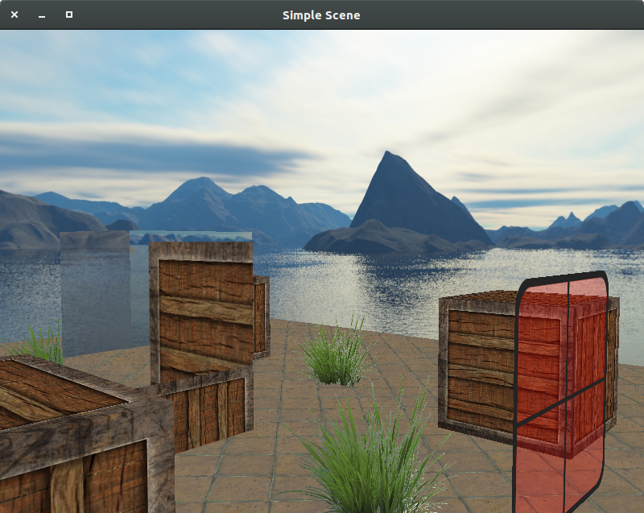

# learnopengl
#### Overview
This is a personal repository that contains experimental and exercise
code for learning OpenGL. These exercises are done
mostly based on tutorial from [learnopengl.com](learnopengl.com).
I'm tying to make some original and interesting demos as long as
I have had enough knowledge and skills on OpenGL programming.
#### Compile
I created this repository on Ubuntu 16.04 with CLion, but I think it can
also work on any Unix-based system with CMake.
Make sure the `/shaders`,  `/models` and the `/textures` folder have
been copied to the executables' location before running them.
#### Some Results
1. A simple lighting scene based on Phong Shading. A point light source,
a directional light source and a spotlight is implemented.

2. Applied the same shader to the nanosuit model acquired from
[learnopengl.com](learnopengl.com)

3. An improved scene with grasses, transparent windows and a box that
reflects all objects in the scene.

